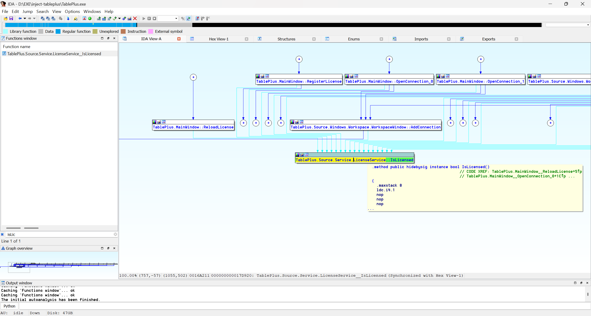
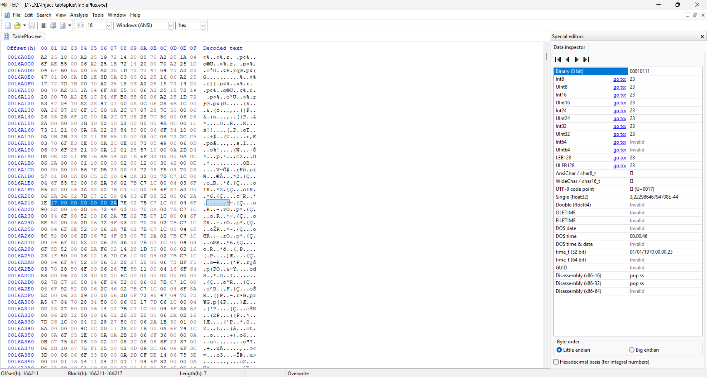

# TBPlus Injector

```
====================================================
=                TBPLUS INJECTOR                  =
====================================================
Inject TablePlus by FaizXor5
GitHub: https://github.com/xor5

[1]. Updates
[2]. Activate Injector
[3]. Deactivate Injector
[4]. Settings
[9]. Info
[0]. Exit (Ctrl+C)

Select a menu option:
```

## Description

TBPlus Injector is a CLI (Command Line Interface)-based tool for managing the inject/patch process on TablePlus applications in a local environment.

This tool is intended for experimentation, learning, and personal use.

## Features

- Simple CLI
- Activate injector
- Deactivate injector
- Update system
- Settings menu
- Application information


## Stages and How It Works

This tool was created through a series of reverse engineering processes using IDA Pro, then tested manually using HxD, by changing the validation so that it is always correct at the offset address.
The following are the modified offset addresses and bytecode.

- IDA Pro



- HxD

```
offset_address = 0x0016A211
old_byte = 02 7B C6 1C 00 04 2A
new_byte = 17 00 00 00 00 00 2A
```

## Install

- Download Python>=v3.10.x
```
git clone https://github.com/Faiz3/TablePlus-Injector.git
cd TablePlus-Injector
```
- Clone https://github.com/xor5/tbplus-injector.git into this directory TablePlus-Injector.
```
git clone https://github.com/xor5/tbplus-injector.git
```
Run in the terminal:
```aiignore
python main.py
```

Or you can download the executable file [TBPlusInjector-Setup](https://github.com/xor5/tbplus-injector/releases/tag/v1.0.0)

## System Requirements

- Windows 10 / 11 (64-bit)
- TablePlus already installed
- Administrator privileges
- Command Prompt / PowerShell

## How to Use

1. Run the application via Command Prompt or PowerShell
2. Make sure to run it as Administrator
3. Select the menu:
   - 1 → Updates
   - 2 → Activate Injector
   - 3 → Deactivate Injector
   - 4 → Settings
   - 9 → Info
   - 0 → Exit

## Notes

Use this tool only on your own system.
All risks associated with its use are the responsibility of the user.

## Development Process Support Tools

- IDA Pro
- HxD
- VSCode

## Author

FaizXor5  
https://github.com/xor5
